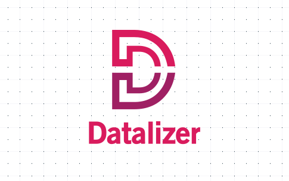
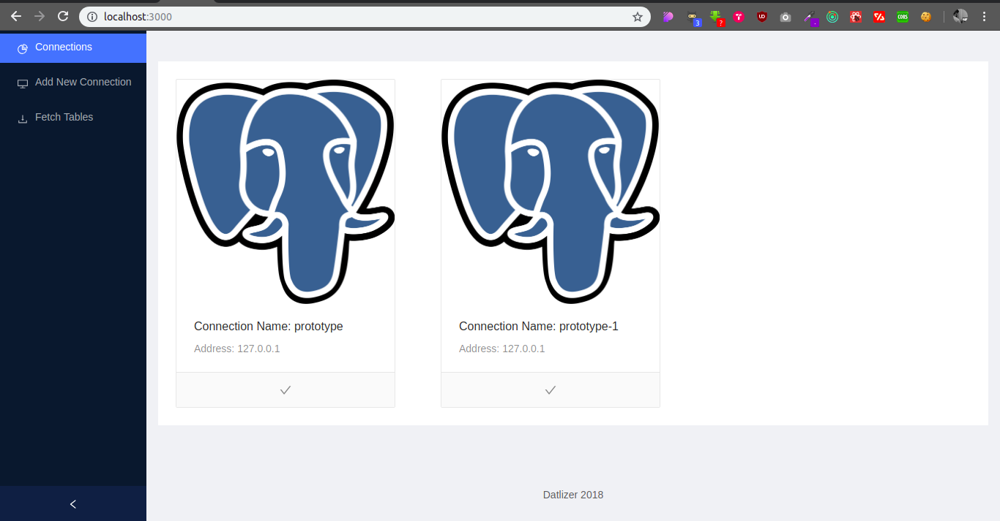
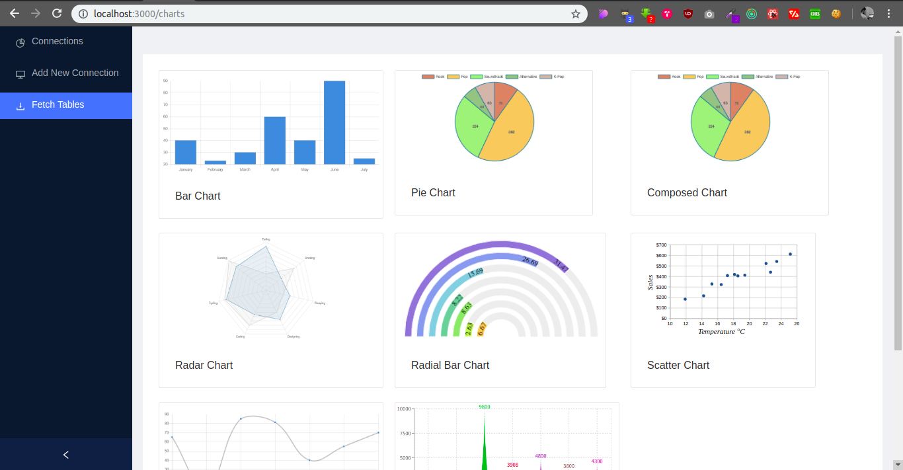
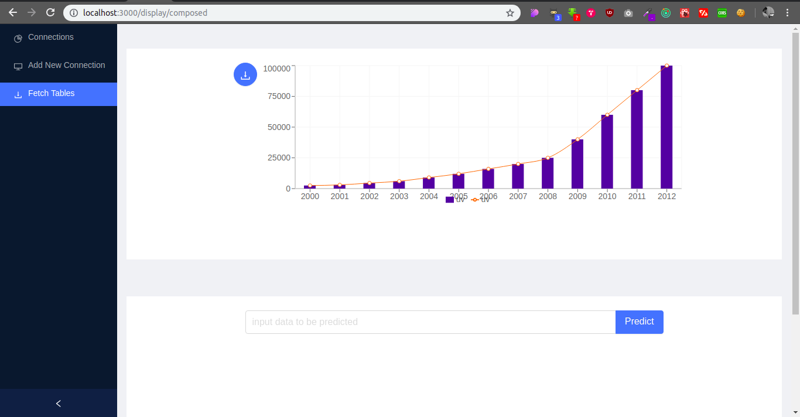
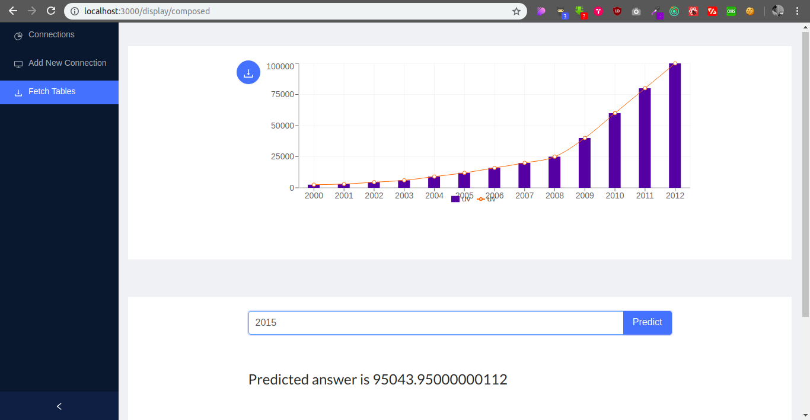

# Welcome to Datlizer!

Datlizer is a database visualisation tool by which anyone can connect to their database and select data to be visualised and we will provide you with different types of visualisation which can obtained from your data. We even have included Machine Learning which can be used to predict future results or classify the current state of the data and much more.

# Steps to run

## Backend
NOTE : make sure you have postgres installed in your system and enter your database details in env file. 
* run `git clone https://github.com/Datlizer/Backend.git`
*  open the cloned folder in terminal
*  `virtualenv venv`
*  `source venv/bin/activate `
*  `pip install -r requirements `
* `python manage.py migrate `
*  `python manage.py runserver localhost:8001`

## Frontend
 * run `git clone https://github.com/Datlizer/Frontend.git` 
 * open the cloned folder in terminal 
 *  `yarn install`
 *  `yarn start` 
 *  Open http://localhost:3000 in your browser

## Features
* Connect to different types of databases
* Visualise any columns of different tables
* Predict future values using machine learning algorithms
* Download visualised chart as SVG

## Screenshots

## Demo

## Supporting Services
* Postgresql
* MySQL
* MongoDB ( Coming soon )

## Future Work
* Add query based fetching of data
* Download data as CSV
* Add more type of charts available
* Show only meaningful charts instead of all
* Plot against more number of columns
* Add support to more database services

## Contributions
Everyone is open to make any type of contributions to this project. If you find any bugs or need any features to be added you are free to create an issue and if you are able to solve the issue we'll be happy else we will be solving it.
